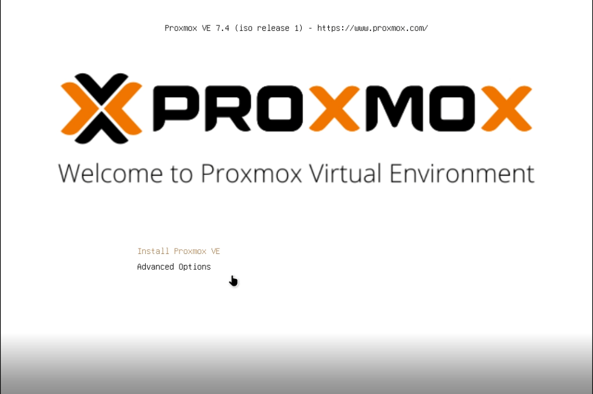
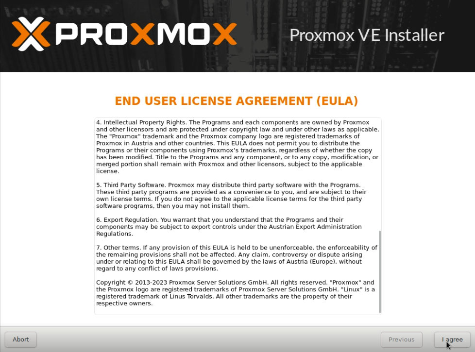
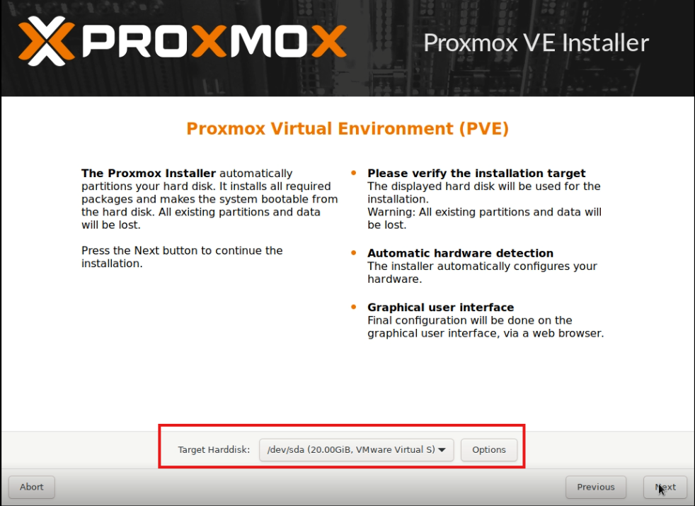
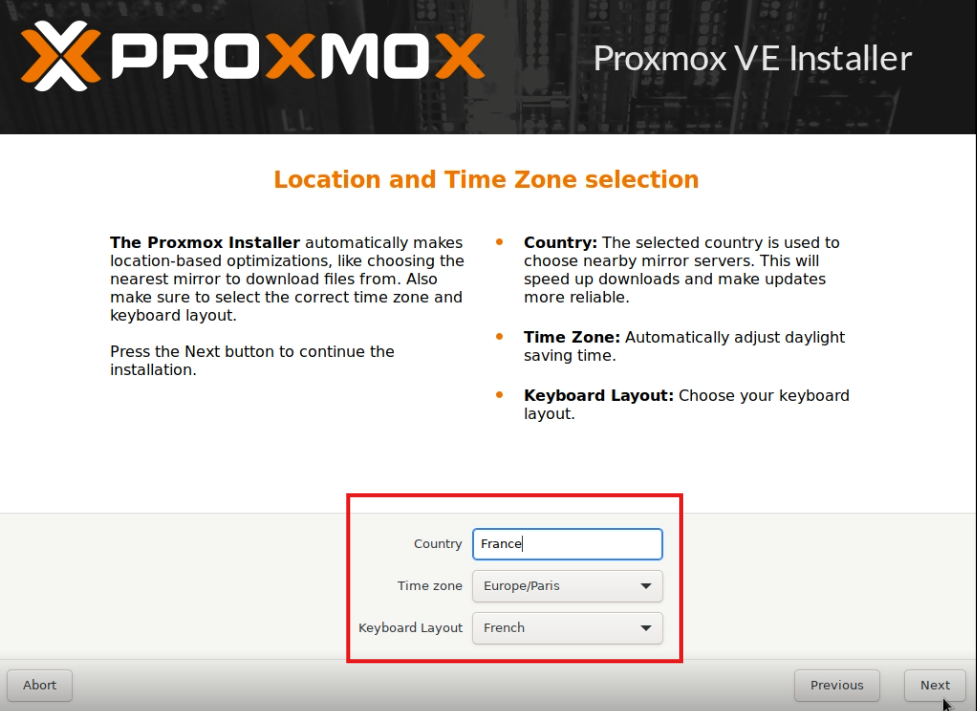
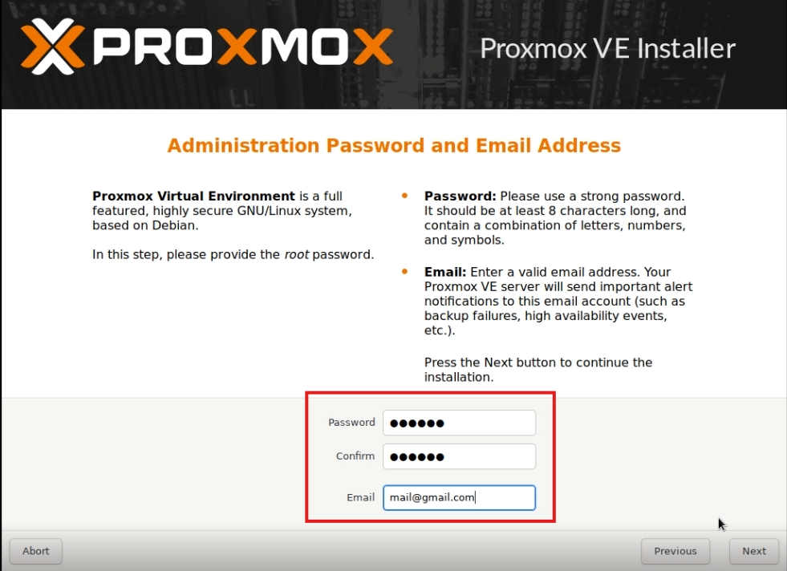
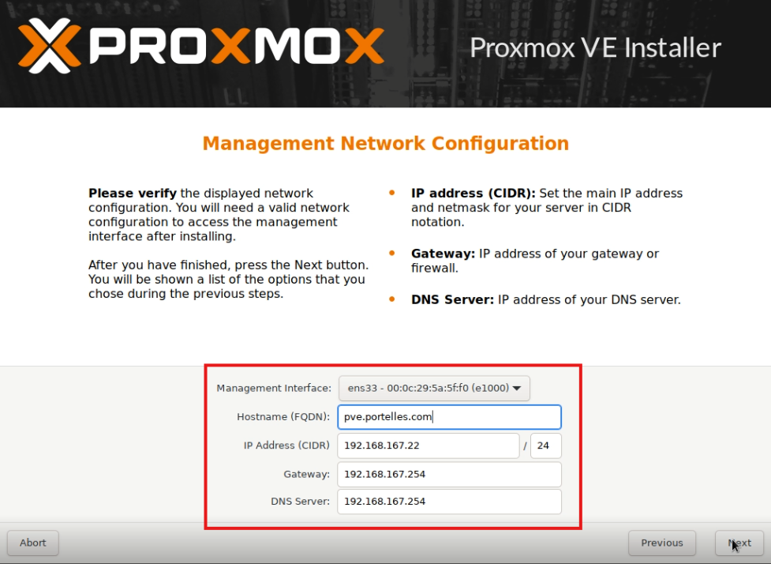

# Installation de Proxmox sur un serveur Dell PowerEdge R810  
## Pour les besoins de la doc l'installation a été réalise sur une VM donc l'adressage IP, le volume du disque, mot de passe etc diffèrent de mon dossier.  
### Prérequis :
  Clé bootable sur Proxmox v7.4 (version ancienne car carte contrôleur RAID trop ancienne pour les paquets du kernel Linus récent)

### Place à l'installation :  
Après que le serveur ai booté sur la clé l'installateur Proxmox affiche ceci :   

Cliquez sur "Install Proxmox VE"  

Puis acceptez les conditions générales d'utilisation : 

  

Suite à cela il vous est demandé de choisir le disque d'installation : 

A présent le choix de la langue/fuseau horaire/disposition du clavier est demandé :  

  

L'étape précédente effectué il faut a présent définir un mot de passe fort et une adresse email :  

Viens après le moment où il faut attribuer une adresse IP au serveur :  

