# Configuration de Proxmox
### Après avoir installé Proxmox, il est temps de se connecter sur l'interface web !  
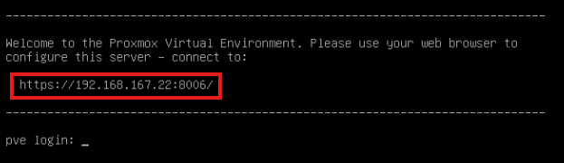  

---
#### Depuis un navigateur tapez l'adresse IP du serveur Proxmox ( il faut être dans le même range IP ou avoir des règles de flux qui autorise la connexion sur cette IP)  
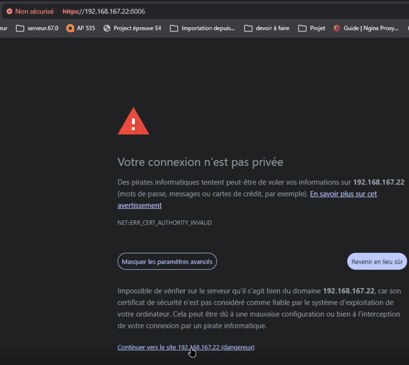  
> Proxmox utilise un certificat autosigné d'où le message d'erreur. Il faut cliquer sur "Continuez vers..."  

----

## Avant de créer les utilisateurs et les groupes il faut monter le volume de disques et créer les partitions respectives pour chaque groupe.        

-----        

### Nettoyage du disque

#### `wipefs -a /dev/sdb`
Efface toutes les **signatures de système de fichiers** (ext4, ntfs, swap, etc.) présentes sur le disque `/dev/sdb`.  
L'option `-a` signifie *all* : toutes les signatures sont supprimées, pas uniquement la première trouvée.  

---

#### `sgdisk --zap-all /dev/sdb`
Supprime **toutes les tables de partitions** (MBR et GPT) présentes sur `/dev/sdb`.  
`--zap-all` détruit à la fois les données GPT en début et en fin de disque, ainsi que la table MBR.  

---

### Création des partitions (GPT)

> `sgdisk` est un outil de gestion de partitions au format **GPT** (GUID Partition Table).  
> La syntaxe `-n` signifie *new partition* : `-n <numéro>:<début>:<fin>`  
> `0` pour le début/fin signifie **"utiliser l'espace disponible suivant"**.

#### `sgdisk -n 1:0:+300G /dev/sdb`
Crée la **partition n°1** en démarrant au premier secteur disponible (`0`) jusqu'à **+300 Go** après ce point.

#### `sgdisk -n 2:0:+300G /dev/sdb`
Crée la **partition n°2** juste après la partition 1, d'une taille de **300 Go**.

#### `sgdisk -n 3:0:+300G /dev/sdb`
Crée la **partition n°3** juste après la partition 2, d'une taille de **300 Go**.

#### `sgdisk -n 4:0:0 /dev/sdb`
Crée la **partition n°4** qui occupe **tout l'espace restant** sur le disque.  
Le second `0` (fin) indique à `sgdisk` d'utiliser le dernier secteur disponible.

---

### Formatage des partitions en ext4

> `mkfs.ext4` crée un système de fichiers **ext4** (Fourth Extended Filesystem).

#### `mkfs.ext4 /dev/sdb1`
Formate la partition 1 en **ext4**.

#### `mkfs.ext4 /dev/sdb2`
Formate la partition 2 en **ext4**.

#### `mkfs.ext4 /dev/sdb3`
Formate la partition 3 en **ext4**.

#### `mkfs.ext4 /dev/sdb4`
Formate la partition 4 en **ext4**.        

---

## Vérification de l'état du disque

### `lsblk`
Liste tous les **périphériques de type bloc** (disques, partitions, etc.) sous forme d'arborescence.  
Permet de vérifier que les partitions ont bien été créées sur `/dev/sdb`.        

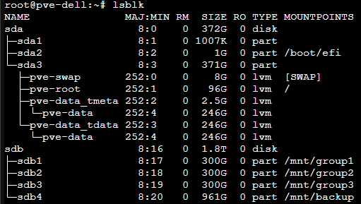        

---

### Création des répertoires de montage

> Avant de monter une partition, le **répertoire de destination doit exister**. Il faut donc toujours créer les dossiers avec `mkdir` avant d'utiliser `mount`.

#### `mkdir /mnt/group1`
Crée le répertoire `/mnt/group1` qui servira de point de montage pour la partition 1.

#### `mkdir /mnt/group2`
Crée le répertoire `/mnt/group2` qui servira de point de montage pour la partition 2.

#### `mkdir /mnt/group3`
Crée le répertoire `/mnt/group3` qui servira de point de montage pour la partition 3.

#### `mkdir /mnt/backup`
Crée le répertoire `/mnt/backup` qui servira de point de montage pour la partition 4 (backup).

---

### Montage des partitions

> `mount` attache un système de fichiers à un répertoire (point de montage) de l'arborescence Linux.  
>  Maintenant que les dossiers existent, on peut monter les partitions.  

#### `mount /dev/sdb1 /mnt/group1`
Monte la partition 1 dans le répertoire `/mnt/group1`.

#### `mount /dev/sdb2 /mnt/group2`
Monte la partition 2 dans le répertoire `/mnt/group2`.

#### `mount /dev/sdb3 /mnt/group3`
Monte la partition 3 dans le répertoire `/mnt/group3`.

#### `mount /dev/sdb4 /mnt/backup`
Monte la partition 4 (backup) dans le répertoire `/mnt/backup`.

---

## Vérification des UUID et systèmes de fichiers

##### `lsblk -f /dev/sdb`
Affiche les informations détaillées des partitions de `/dev/sdb`, notamment :
- Le **type de système de fichiers** (ext4, etc.)
- L'**UUID** de chaque partition
- Le **point de montage** actuel  

> Pour récupérer les UUID nécessaires à la configuration de `/etc/fstab`.

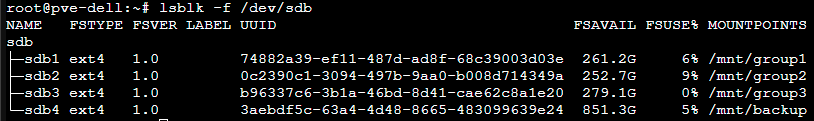        

---

### Configuration du montage automatique

#### `nano /etc/fstab`  

Ouvre le fichier de configuration `/etc/fstab` avec l'éditeur de texte **nano**.  

`/etc/fstab` contient la liste des systèmes de fichiers à **monter automatiquement au démarrage**.   

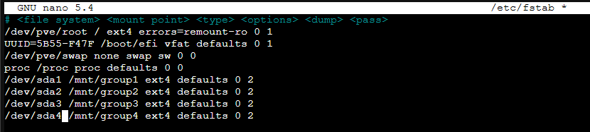      

> Après avoir monté le volume de disque, créer les partitions et les dossiers pour les groupes place à la création des comptes et groupes avec rôle.
----

# Création des comptes, des groupes et des rôles.    
### Chaque groupe ne doit voir que son pool qui lui est attribuer. Chaque utilisateur est réparti dans un groupe en fonction de la population existante dans un groupe (si le groupe 1 contient 3 utilisateurs, il faut donc peupler un autre groupe par soucis de stockage dû aux partitions crées)  

------
### Création des comptes users :  
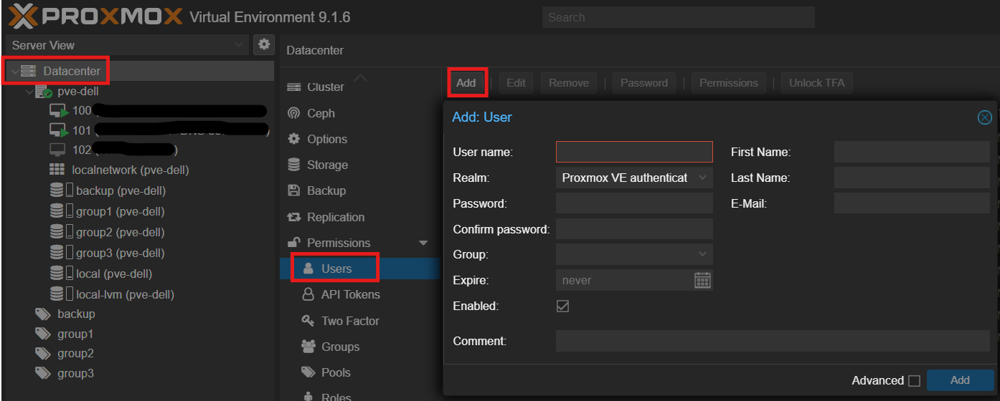  

----

### Création des groupes :   

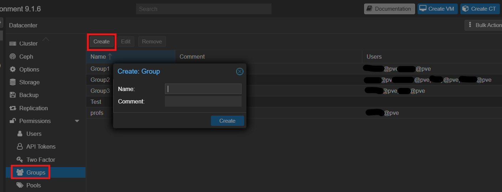  

----

### Création du rôle commun aux utilisateurs :  

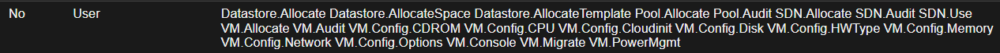  

----

### Création des pools pour les groupes et le backup :  

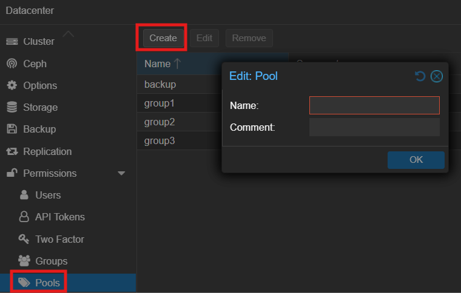
  

----

### Création du stockage par groupe et pour le backup

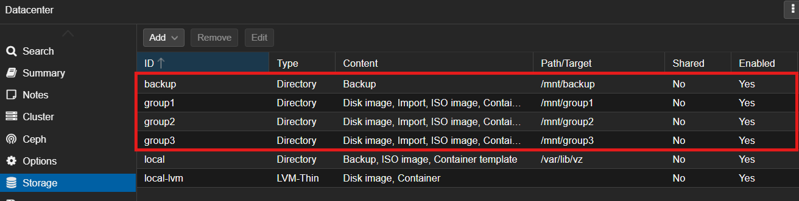  

-----

### Ajout du stockage dans les pools :   

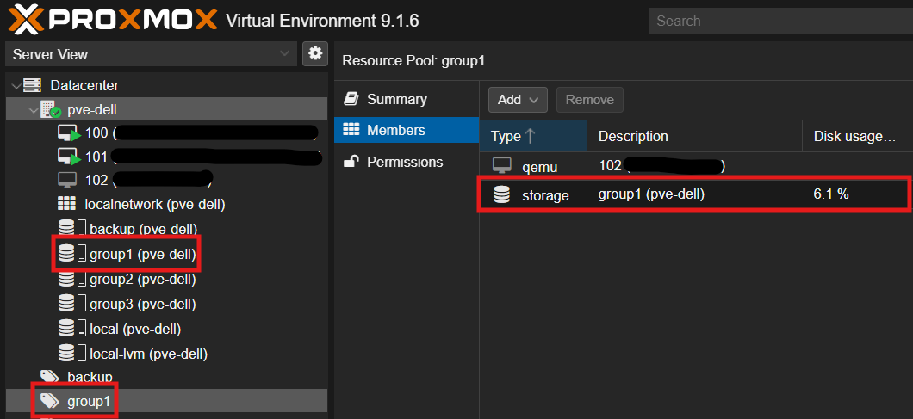  

----
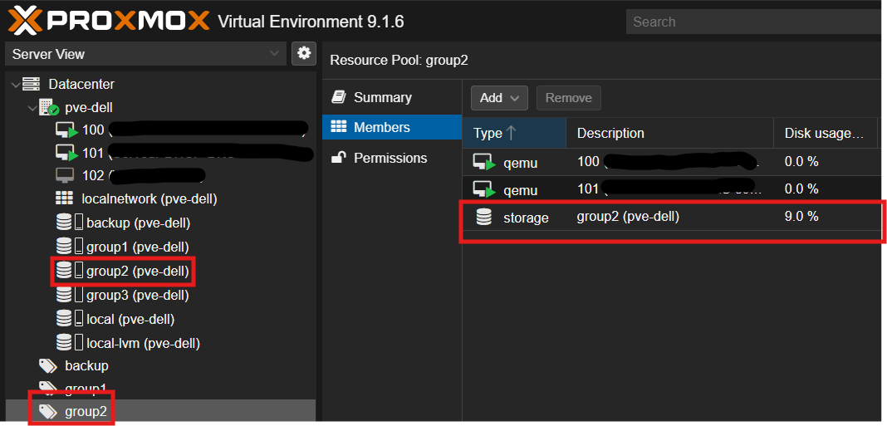    

----
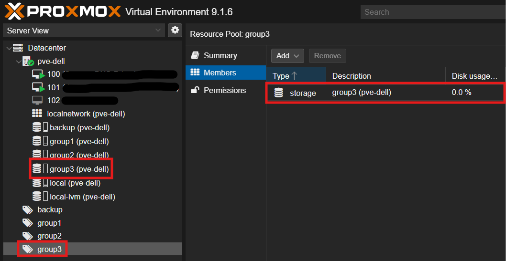  

----
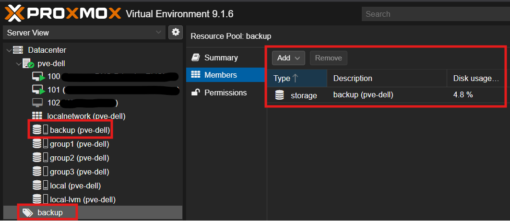  

----

# Création d'un agrégat de 4 ports RJ45 :  
### Afin de créer de la résilience et un débit plus conséquent j'ai agrégé les 4 ports RJ45 du serveur Dell.  
----
#### Pour pouvoir agrégé les ports il faut connaître leur nom respectif. J'ai donc fait un > cat /etc/network/interfaces.  
